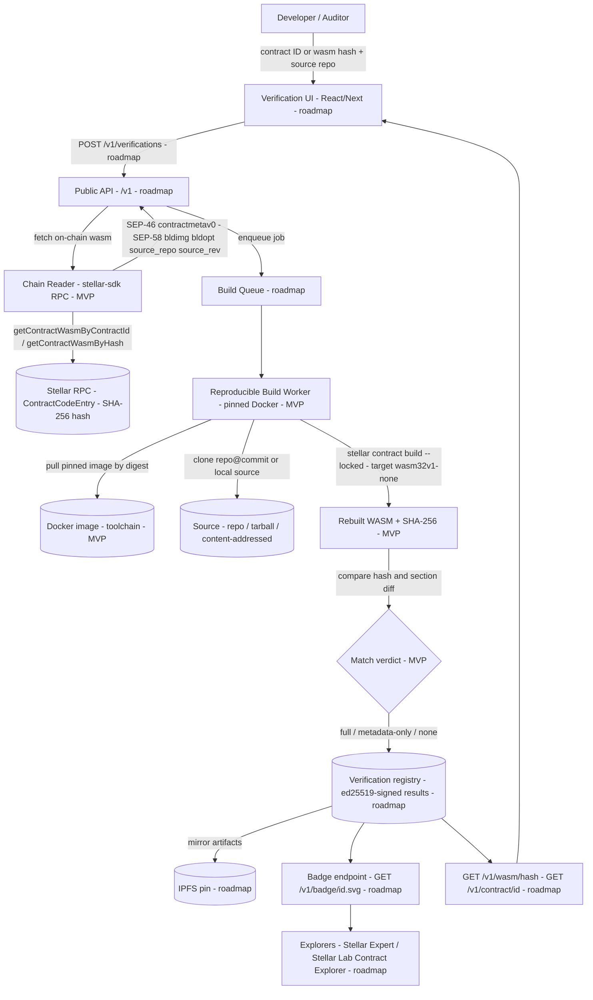

> ⚠️ **Testnet-only. NOT audited.** This repo contains a Soroban smart contract
> (`contracts/hello-soroban`) used as a verification fixture. Soroban contracts
> here handle auth/funds and MUST be reviewed by Bleu's in-house Rust engineer
> before any mainnet use or "audited" claim. Do not present generated contract
> code as production-ready.

# Soroscan Verify — Soroban Contract Source Verification Service (MVP)

Open-source, Docker-based **reproducible-build** verification for Soroban
contracts. It proves that a deployed contract's on-chain WASM (its SHA-256 hash)
is byte-for-byte the published source — by independently **re-compiling** the
source on neutral infrastructure and comparing hashes, not by trusting a build
provenance attestation.

This repo is the working MVP of the service: a single pinned toolchain, a
chain reader, and a verify-by-contract-ID CLI. The full design — the hosted
multi-verifier service, `/v1` public API, UI, multi-toolchain selection, and
explorer integrations — is specified in
**[docs/ARCHITECTURE.md](docs/ARCHITECTURE.md)** (see [Roadmap](#roadmap)).

License: **Apache-2.0**.

## Why this exists

Soroban contracts are deployed as opaque WASM blobs. When a contract is uploaded
(`InvokeHostFunction` / UploadContractWasm), the ledger stores the bytecode in a
`ContractCodeEntry` keyed by the **SHA-256 of the executable** — the Stellar docs
describe the upload output as "the Sha256 hash of the executable". A deployed
instance references that WASM by hash.

So source verification reduces to one question:

> **Can we rebuild a candidate source repo into a WASM whose SHA-256 equals the
> hash the ledger reports for this contract?**

Today's tooling (stellar.expert's build workflow, the Contract Build
Verification SEP — [SEP-0055], formalized from [discussion #1573]) relies on
GitHub Attestations, which attest that *a GitHub Action ran and produced a
WASM*. The official Stellar Lab Contract Explorer is explicit that its "Build
Verified" badge "only means that the GitHub Action run has attested to have
built the Wasm, but does not verify the source code." Soroscan Verify adds the
complementary **independent, neutral, reproducible-build** layer ([SEP-0058])
— the Soroban analogue of [Sourcify]'s bytecode-match model for Ethereum (full
match vs. partial match). SEP-55 answers "did trusted CI build this?"; the
rebuild layer answers "does this source produce these bytes?".

## Architecture (data flow)

The diagram uses the SDK method names as they actually exist on
`@stellar/stellar-sdk`'s `rpc.Server` (`getContractWasmByContractId`,
`getContractWasmByHash`, `getLedgerEntries`) — confirmed present on
`rpc.Server.prototype` in the installed SDK (v15.1.0).



Pieces labeled **MVP** are implemented and tested in this repo. Pieces labeled
**roadmap** are specified in [docs/ARCHITECTURE.md](docs/ARCHITECTURE.md) but
not built here.

## Stack (plain English)

- **Sample contract** (`contracts/hello-soroban`): a minimal `soroban-sdk`
  contract, deployed to testnet, that the pipeline rebuilds and hash-matches.
  Rust, `wasm32v1-none`, built with `stellar contract build --locked`.
- **Pinned build image** (`docker/Dockerfile`): one content-addressed Docker
  image per toolchain. Pins rustc/cargo, `stellar-cli`, and the wasm target so a
  build is independently re-runnable: pull the image by digest, run it, get the
  same hash. Runs network-isolated (`--network=none`) during compile.
- **Chain reader** (`reader/src/chain-reader.ts`): TypeScript over
  `@stellar/stellar-sdk` RPC. Fetches the on-chain WASM + SHA-256 for a contract
  ID (`getContractWasmByContractId`) or a WASM hash (`getContractWasmByHash`).
- **contractmeta reader** (`reader/src/contractmeta.ts`): parses the SEP-46
  `contractmetav0` WASM custom section, used for the metadata-only-mismatch
  verdict, and decodes its XDR `SCMetaEntry` records.
- **SEP-58 metadata** (`reader/src/sep58.ts`): extracts the six SEP-58 fields
  (`bldimg`, `bldopt` (repeatable), `source_repo`, `source_rev`,
  `tarball_url`, `tarball_sha256`) from the decoded entries and infers the
  **source mode**, one per conformant combination in SEP-58 §2: `public-repo`
  (`source_repo` + `source_rev`), `hosted-tarball` (`tarball_url` +
  `tarball_sha256`), `hosted-tarball-unpinned` (`tarball_url` alone),
  `content-addressed` (`tarball_sha256` alone), or `none`.
- **Verify CLI** (`reader/src/cli.ts`, bin `soroscan-verify`): `read` and
  `verify` subcommands. `read` works by `--id` or `--wasm-hash` and prints the
  meta entries, SEP-58 fields, and source mode alongside the hash. `verify`
  rebuilds-compares and exits 0 only on a byte-for-byte full match.

## Verification primitive (verified in this repo)

`shasum -a 256` of the WASM produced by `stellar contract build` equals (a) the
"Wasm Hash" the CLI prints, (b) the hash the ledger stores in the
`ContractCodeEntry` (confirmed by `stellar contract fetch` of the deployed
fixture), and (c) the hash the TypeScript reader computes from the WASM it pulls
over RPC. All are:

```
6fe7bd58e5a33dc27daefc74acfae6eb70f101fdbde860475cf18fde87288e4b
```

### Verdict model (Sourcify analogue)

| Verdict | Meaning |
|---------|---------|
| `FULL_MATCH` | Rebuilt WASM is byte-identical to on-chain WASM (SHA-256 equal). The deployed blob **is** the source. |
| `METADATA_ONLY_MATCH` | WASM differs **only** in the `contractmetav0` custom section (behaviorally identical) — Sourcify "partial match" analogue. |
| `NO_MATCH` | Hashes differ and the difference is not metadata-only. |
| `ERROR` | Could not fetch/compare (network, malformed ID, etc.). |

### Image trust (orthogonal to the verdict)

Reproducibility alone is not faithfulness to source: a hostile build image can
deterministically rewrite bytes and still pass byte-comparison. So every verify
result also carries an `imageTrust` tier, derived by looking up the contract's
SEP-58 `bldimg` in the checked-in [`docker/allowlist.json`](docker/allowlist.json):

| Tier | Meaning |
|------|---------|
| `sdf-trusted` | Image digest is on the SDF-trusted allowlist (official `stellar-cli-docker` releases). |
| `publicly-auditable` | Image is allowlisted as a publicly-auditable third-party image (e.g. this repo's pinned toolchain image). |
| `arbitrary` | A `bldimg` was declared but is not allowlisted. |
| `unknown` | No `bldimg` metadata available. |

Eviction from the allowlist downgrades the tier reported for past
verifications; it never deletes verification records.

## Quick start

Prereqs: `rust 1.91.1`, `nodejs 24.11.0` (see `.tool-versions`), `stellar` CLI
26.1.0, `pnpm`. `wasm32v1-none` target installed.

```bash
# 1. Build + test the sample contract (produces the WASM)
cd contracts
cargo test --locked
stellar contract build --locked          # -> target/wasm32v1-none/release/hello_soroban.wasm

# 2. Build the reader/CLI
cd ../reader
pnpm install
pnpm test                                # unit tests (no network)
pnpm run build

# 3. Read the on-chain WASM hash + SEP-58 source metadata for the deployed
#    fixture (also accepts --wasm-hash <hex> instead of --id)
node dist/cli.js read \
  --id CDVSGPL3HFBGJ6ZEYQUAVE3OH3XE2ZE5ZT2GWPA3LKOYVD4UBPQJ2VHB

# 4. Verify by ID: rebuild-compare against the chain (exit 0 only on FULL_MATCH)
node dist/cli.js verify \
  --id CDVSGPL3HFBGJ6ZEYQUAVE3OH3XE2ZE5ZT2GWPA3LKOYVD4UBPQJ2VHB \
  --wasm ../contracts/target/wasm32v1-none/release/hello_soroban.wasm
```

Or run the whole thing via the driver:

```bash
scripts/verify.sh CDVSGPL3HFBGJ6ZEYQUAVE3OH3XE2ZE5ZT2GWPA3LKOYVD4UBPQJ2VHB
# add --docker to build inside the pinned image
```

## Deterministic build via Docker

```bash
docker build -t soroscan-verify-builder:rust-1.91.1-cli-26.1.0 ./docker
docker run --rm --network=none \
  -v "$PWD/contracts":/work \
  soroscan-verify-builder:rust-1.91.1-cli-26.1.0
shasum -a 256 contracts/target/wasm32v1-none/release/hello_soroban.wasm
```

For true reproducibility, pin the base image **by digest** and publish it in
`docker/toolchain-manifest.json` (the manifest records the resolved digest).

## Live testnet fixture

| Field | Value |
|-------|-------|
| Network | Stellar **testnet** |
| Contract ID | `CDVSGPL3HFBGJ6ZEYQUAVE3OH3XE2ZE5ZT2GWPA3LKOYVD4UBPQJ2VHB` |
| WASM hash (SHA-256) | `6fe7bd58e5a33dc27daefc74acfae6eb70f101fdbde860475cf18fde87288e4b` |
| WASM size | 1060 bytes |
| Toolchain | rust 1.91.1, stellar-cli 26.1.0, soroban-sdk 25.3.1, `wasm32v1-none` |
| Explorer | https://stellar.expert/explorer/testnet/contract/CDVSGPL3HFBGJ6ZEYQUAVE3OH3XE2ZE5ZT2GWPA3LKOYVD4UBPQJ2VHB |

The live chain-read test is opt-in: `SOROSCAN_INTEGRATION=1 pnpm exec vitest run
test/integration.testnet.test.ts`.

## Reproducibility & honest caveats

- **Determinism is shown, not assumed.** `stellar contract build --locked`
  asserts `Cargo.lock` is unchanged (the documented reproducible-build lever).
  Two clean rebuilds on this toolchain produce the identical hash above, matching
  the on-chain WASM. The Stellar docs do **not** guarantee byte-for-byte
  reproducibility or `wasm-opt`/`--optimize` determinism across machines — that is
  an open question handled by pinning the full toolchain via Docker image digest
  and by the `METADATA_ONLY_MATCH` verdict for behaviorally-identical builds.
- **TESTNET ONLY.** No mainnet config is wired up; `resolveNetwork` rejects
  anything but `testnet`.
- **Soroban SDK version.** This fixture pins `soroban-sdk =25.3.1`, the version
  OpenZeppelin's `stellar-contracts` `0.7.1` requires (`^25.3.0`, verified via the
  crates.io sparse index) — Bleu's validated default base. OZ-composed contracts
  reproduce on this same SDK; real submissions select their build image by the
  toolchain advertised in their on-chain `contractmetav0` (`rsver`/`rssdkver`).

## Roadmap

The full roadmap is in [docs/ARCHITECTURE.md §11](docs/ARCHITECTURE.md); in
summary:

| Phase | Scope |
|-------|-------|
| **MVP (this repo)** | Single pinned toolchain, chain reader, verify-by-ID CLI, deterministic hash-match proof on testnet. |
| 1 — Self-hostable verifier core | ed25519 result signing, image allowlist + trust tiers, all three SEP-58 source modes, IPFS retrieval, sandboxed rebuild workers. |
| 2 — Audit + hosted deployment | Independent security audit; public **testnet + mainnet** deployment; retroactive (off-chain metadata) submission path. |
| 3 — Stable `/v1` API + SDK + docs | `GET /v1/contract/{id}`, `GET /v1/wasm/{hash}`, `POST /v1/verifications`, `GET /v1/verifiers`; client SDK; allowlist policy doc; under-15-minute walkthrough. |
| 4 — Integrations | Badge endpoint (`GET /v1/badge/{id}.svg`), explorer embed, stellar-cli interaction, partner reference integration. |
| 5 — Production operations | Runbook, monitoring, on-call, peer-operator support. |

## References

- Stellar CLI manual — `stellar contract build` (`--locked`, `--meta`, `--optimize`)
- "Sha256 hash of the executable" — Stellar upgrading-contracts docs
- Retrieve a contract code ledger entry (LedgerKeyContractCode / getLedgerEntries)
- `@stellar/stellar-sdk` `rpc.Server` API reference (method names)
- [SEP-0046] Contract Meta (`contractmetav0` / SCMetaEntry)
- [SEP-0055] Contract Build Verification (GitHub-Attestation provenance; alongside [discussion #1573])
- [SEP-0058] Contract Build Reproducibility for Verification (`bldimg`, `bldopt`, `source_repo`, `source_rev`, `tarball_url`, `tarball_sha256`)
- [Sourcify] — Ethereum source verification (full vs partial match) prior art
- OpenZeppelin `stellar-contracts` (Rust Soroban library)
- Service design & roadmap: [docs/ARCHITECTURE.md](docs/ARCHITECTURE.md)

[SEP-0046]: https://github.com/stellar/stellar-protocol/blob/master/ecosystem/sep-0046.md
[SEP-0055]: https://github.com/stellar/stellar-protocol/blob/master/ecosystem/sep-0055.md
[SEP-0058]: https://github.com/stellar/stellar-protocol/blob/master/ecosystem/sep-0058.md
[discussion #1573]: https://github.com/orgs/stellar/discussions/1573
[Sourcify]: https://github.com/ethereum/sourcify
