# Soroscan Verify — Contract Source Verification Service

**Grant proposal in response to the SDF RFP "Contract Source Verification Service" (Q2 2026)**

- **Applicant:** Bleu (bleu.studio)
- **Repository:** `scf-contract-source-verification` (Apache-2.0, public)
- **Working MVP:** chain reader, verify-by-contract-ID CLI, pinned Docker build toolchain, live testnet fixture with a matching on-chain hash
- **Date:** June 2026

---

## 1. Summary & current state

Soroban contracts are deployed as opaque Wasm blobs, stored on the ledger
under the SHA-256 of the bytecode. Source verification is therefore one
testable question: *can this source be rebuilt into a Wasm whose SHA-256
equals the hash on the ledger?*

We propose a hosted, free, public service that answers that question for the
whole ecosystem. It reads the SEP-58 metadata fields (`bldimg`, `bldopt`,
`source_repo`, `source_rev`, `tarball_url`, `tarball_sha256`), rebuilds the
source inside SDF-allowlisted build images, byte-compares the result against
the deployed Wasm, and serves signed results to explorers, wallets, and the
Stellar CLI through a versioned API. One shared result layer — no per-consumer
rebuilds, no single hardcoded verifier.

The core of this is already built and public. Our MVP repo proves:

- **A deterministic rebuild matches the chain.** A sample contract
  (soroban-sdk 25.3.1, target `wasm32v1-none`) is live on testnet as
  `CDVSGPL3HFBGJ6ZEYQUAVE3OH3XE2ZE5ZT2GWPA3LKOYVD4UBPQJ2VHB`. Rebuilding it
  with the pinned toolchain (`stellar contract build --locked`, rustc 1.91.1,
  stellar-cli 26.1.0) yields a Wasm whose SHA-256,
  `6fe7bd58e5a33dc27daefc74acfae6eb70f101fdbde860475cf18fde87288e4b`, equals
  the hash printed at upload, the hash stored on the ledger, and the hash our
  reader computes from the Wasm it fetches over RPC. Two clean rebuilds give
  the same hash.
- **A chain reader over Stellar RPC** (`reader/src/chain-reader.ts`): fetches
  on-chain Wasm by contract ID or directly by Wasm hash — one verified hash
  covers every contract instance that shares the bytecode.
- **A verify CLI with a graded verdict model**: `FULL_MATCH`
  (byte-identical), `METADATA_ONLY_MATCH` (differs only in the SEP-46
  `contractmetav0` custom section, detected by stripping that section and
  re-comparing), `NO_MATCH`, or `ERROR`. Exit code 0 only on `FULL_MATCH`, so
  it works in CI.
- **A pinned, network-isolated build environment** (`docker/Dockerfile`):
  rustc, stellar-cli, and the Wasm target pinned; the build runs with
  `--network=none`. The resolved toolchain is recorded in
  `docker/toolchain-manifest.json`.

The grant funds the path from this primitive to the full service: signed
multi-verifier results, all three SEP-58 source modes, the image allowlist
with trust tiers, the public API, retroactive verification, integrations, a
third-party audit, and production operations.

## 2. Architecture & SEP-58 alignment

SEP-58 ("Contract Build Reproducibility for Verification") defines the
vocabulary that lets anyone re-run a contract's build and compare the output
to the deployed bytes. Every field drives one pipeline step, and the pipeline
needs nothing outside the SEP. The fields normally live in the Wasm's
`contractmetav0` custom section (SEP-46); we also accept them via off-chain
submission for contracts deployed before the tooling existed (§7).

| SEP-58 field | Meaning | What the pipeline does with it |
|---|---|---|
| `bldimg` | Container image, **pinned by digest** | Checked against the allowlist (§4), assigned a trust tier, pulled by digest — never by tag. Tag-only references are rejected. |
| `bldopt` | One build flag per entry, passed verbatim | Each flag is appended, in order, to `stellar contract build` inside the container. Nothing is shell-evaluated on the host. |
| `source_repo` | HTTPS URL of the source repository | Mode-1 source acquisition: clone the repo. |
| `source_rev` | Full 40-char commit SHA-1 | Check out exactly this commit; branch and tag names are not accepted. |
| `tarball_url` | Where to download the source tarball | Mode-2 acquisition, over HTTPS or IPFS (§3). |
| `tarball_sha256` | SHA-256 of the tarball | Integrity check before extraction (mode 2); on its own, the lookup key for private source (mode 3). |

```mermaid
flowchart TD
    subgraph Claim["Claim channel (SEP-58)"]
        Meta[contractmetav0 fields in deployed Wasm - SEP-46]
        Retro[Off-chain metadata submission - retroactive path]
    end
    Dev[Developer: CLI or web] -->|POST /v1/verifications| API[Public API - versioned /v1]
    Explorer[Explorers / wallets / CLI] -->|GET /v1/contract/id - GET /v1/wasm/hash| API
    API --> Reader[Chain reader - Stellar RPC, mainnet + testnet]
    Reader -->|getContractWasmByContractId / getContractWasmByHash| Ledger[(ContractCodeEntry - SHA-256-keyed Wasm)]
    Reader --> Meta
    Retro --> Queue
    API -->|enqueue job| Queue[Build queue]
    Queue --> Acquire[Source acquisition - repo@rev, tarball, content-addressed]
    Acquire --> Store[(Content-addressed artifact store + IPFS pin)]
    Acquire --> Allow{bldimg digest vs allowlist}
    Allow -->|trust tier recorded| Worker[Rebuild worker - ephemeral, network-isolated]
    Worker -->|stellar contract build + recorded bldopt| Rebuilt[Rebuilt Wasm + SHA-256]
    Rebuilt --> Compare{Byte compare vs on-chain Wasm}
    Compare -->|verdict| Sign[ed25519-signed verification result]
    Sign --> DB[(Verification registry - append-only)]
    Peers[Other self-hosted verifiers] -->|signed results| DB
    DB --> API
```



The chain reader, verdict logic, and pinned rebuild container are running MVP
code; the queue, registry, signing layer, and API are the grant work. The
service runs against **both mainnet and testnet** from launch (the MVP's
testnet-only guard is lifted in milestone M2).

Verification is keyed by **Wasm hash**, not contract ID. The contract-ID
endpoint resolves the instance's current code hash and joins to verifications
of that hash. So one verification covers every instance sharing the bytecode,
and a contract upgrade simply shows up as "current code unverified" — no
stale badges.

## 3. Source modes

All three SEP-58 source modes are supported as equals.

**Mode 1 — public repo (`source_repo` + `source_rev`).** Clone, check out the
exact commit, build. The worker also packs the checked-out tree into a
canonical tarball and records its SHA-256, so every verification — whatever
the mode — is anchored to a content-addressed source artifact. If the repo
later disappears or rewrites history, the record still points at bytes we and
IPFS hold.

**Mode 2 — hosted tarball (`tarball_url` + `tarball_sha256`).** Download,
check the SHA-256, extract. A mismatch is a hard `ERROR`, never a silent
fallback. **IPFS is a first-tier retrieval channel alongside HTTPS**:
`tarball_url` may be an `ipfs://` URI, and HTTPS-hosted tarballs are pinned to
IPFS after the integrity check, with the CID recorded in the result — so
verified source stays retrievable even if the original host dies.

**Mode 3 — content-addressed private source (`tarball_sha256` alone).** For
teams whose source is not public. The team hands the tarball directly to one
or more verifiers — typically via an auditor running a verifier instance —
each of which checks the hash, rebuilds, and signs a verdict *without
publishing the source*. The public record says: "source with digest X, built
in image Y, produces the deployed bytes — say verifiers A and B." Any future
disclosure of the tarball can be checked against the digest. The
multi-verifier design (§5) is what makes this credible: several independent
parties can vouch for a rebuild of source the public can't see.

**Tamper-evident storage.** All retained source artifacts are stored by their
SHA-256 in an append-only store and mirrored to IPFS where licensing permits
(mode-3 artifacts only with the submitter's consent). Artifacts can be added,
never changed; since the digest is in the signed result, anyone can detect
tampering by re-hashing.

## 4. Trust model

A verdict is only as meaningful as the environment that produced it, so the
service makes trust explicit on two axes: which build image, and what kind of
evidence.

### Image trust tiers and the allowlist

Every verification records the trust tier of its `bldimg` digest:

- **`sdf-trusted`** — the digest is on the SDF-published allowlist. The
  default allowlist is the digests SDF publishes for `stellar/stellar-cli`
  images from `stellar-cli-docker`, which is explicitly "compatible as a
  SEP-58 image" and itself mandates digest pinning ("a per-arch
  single-architecture digest (`@sha256:…`) … is the only stable reference").
  We will consume SDF's allowlist endpoint directly once it exists; until
  then, a signed config file seeded from the published digests.
- **`publicly-auditable`** — a third-party image admitted through a documented
  governance process: public Dockerfile and build context, the image itself
  reproducibly buildable, digest published by its maintainer, and a public
  review window (a PR against the allowlist repo). This keeps the ecosystem
  from being bottlenecked on SDF images without diluting `sdf-trusted`.
- **`arbitrary`** — any other digest-pinned image. We still run the rebuild
  (the bytes matched or they didn't), but the tier tells consumers the
  environment is unvetted.
- **`unknown`** — the digest can no longer be resolved.

**Allowlist eviction downgrades; it never deletes.** If a digest is removed —
say a vulnerability turns up in an image — past verifications that used it
keep their records. Their trust tier is downgraded, the change is appended to
the record's history with a timestamp and reason, and API responses reflect it
immediately. Trust signals age; evidence does not.

### SEP-55 and SEP-58: two different questions

SEP-55 attestations and SEP-58 rebuilds are **complementary trust levels,
exposed as separate API fields** — never collapsed into one badge. SEP-55
("Contract Build Verification") answers *"did a trusted CI pipeline build
this Wasm from this repo?"* via GitHub artifact attestations: provenance from
a named builder, available instantly, no rebuild cost. A SEP-58 rebuild
answers *"does this source, in this environment, produce exactly these
bytes?"* via independent re-execution. SEP-58's own text calls the two
complementary, "address[ing] the same trust question with different
trade-offs." A contract can and ideally does carry both. We detect and
surface existing SEP-55 attestations for every contract we index, so the
service strengthens that ecosystem rather than competing with it.

## 5. Multi-verifier architecture & decentralization

The RFP asks for a shared result layer with no single hardcoded verifier.
That is a structural property here, not a promise:

- **Every verifier instance is self-hostable.** The verifier is our
  open-source codebase; anyone — an explorer, an auditor, SDF — can run one.
  No closed components, nothing reserved for our deployment.
- **Every verifier holds an ed25519 identity key and signs each result**: a
  canonical encoding of the Wasm SHA-256, the source artifact digest, the
  verdict, the `bldimg` digest, and the timestamp. Signed results are
  portable — relayed or cached anywhere, they still prove who produced them
  and that they weren't altered.
- **The public API serves results from all known verifiers.** Instances
  register their public key and endpoint (open, permissionless, rate-limited);
  the aggregation layer serves their signed results next to ours. A query
  returns the set of per-verifier results, not one merged opinion.
- **Consumers configure a trusted-verifier set.** An explorer might trust
  SDF's instance and ours; a wallet might require two independent
  `FULL_MATCH` results. The client SDK ships with this policy surface.
- **Disagreement is rendered per-verifier, never averaged away:**

  ```
  [√] Verified by X                   FULL_MATCH   image: sdf-trusted
  [!] Mismatching verification by Y   NO_MATCH     image: sdf-trusted
  ```

  Two verifiers disagreeing on the same image and source means toolchain
  non-determinism or a misbehaving verifier — exactly the signal a majority
  vote would hide.

**Our hosted deployment is the first instance, not a privileged one.** It
bootstraps the network and gives explorers something to integrate on day one,
but it signs like any other instance, lists like any other instance, and can
be dropped from any consumer's trusted set.

## 6. Public API specification

Free, public, unauthenticated reads, versioned under `/v1`:

- **`GET /v1/contract/{id}`** — resolve a contract ID to its current Wasm
  hash and return all known verifications of it (with pointers to previous
  hashes for upgraded contracts).
- **`GET /v1/wasm/{hash}`** — all verifications for a Wasm hash; the
  canonical lookup.
- **`POST /v1/verifications`** — submit a verification request: target
  (contract ID or Wasm hash), SEP-58 fields (read from `contractmetav0` when
  present, supplied in the body for the retroactive path), source mode.
  Returns `202` with a job resource.
- **`GET /v1/verifiers`** — known verifier instances: ed25519 public key,
  operator metadata, endpoint, status.

A verification record:

```jsonc
{
  "wasm_hash": "6fe7bd58e5a33dc27daefc74acfae6eb70f101fdbde860475cf18fde87288e4b",
  "network": "testnet",
  "verdict": "FULL_MATCH",            // FULL_MATCH | METADATA_ONLY_MATCH | NO_MATCH | ERROR
  "sep58": {                           // the recorded claim, verbatim
    "bldimg": "docker.io/stellar/stellar-cli@sha256:…",
    "bldopt": ["--locked"],
    "source_repo": "https://github.com/org/contract",
    "source_rev": "0e01e07…(40 hex chars)",
    "tarball_url": null,
    "tarball_sha256": null
  },
  "source_mode": "repo",               // repo | tarball | content-addressed
  "source_artifact": {
    "sha256": "…",
    "ipfs_cid": "bafy…",               // null when retention not permitted (mode 3)
    "retained": true
  },
  "image_trust_tier": "sdf-trusted",   // sdf-trusted | publicly-auditable | arbitrary | unknown
  "image_trust_history": [
    { "tier": "sdf-trusted", "at": "2026-07-01T12:00:00Z", "reason": "allowlisted" }
  ],
  "sep55_attestation": {               // distinct field; never merged into verdict
    "present": true,
    "builder_id": "https://github.com/org/contract/.github/workflows/release.yml@…"
  },
  "verifier": {
    "id": "soroscan-main",
    "public_key": "ed25519:…",
    "signature": "…"                   // over (wasm_hash, source_artifact.sha256, verdict, bldimg digest, timestamp)
  },
  "created_at": "2026-07-01T12:03:41Z",
  "verified_at": "2026-07-01T12:05:12Z"
}
```

**Versioning.** Changes within `/v1` are strictly additive; anything breaking
ships as `/v2`, with both served through a deprecation window of at least six
months. **We commit to conforming to the forthcoming verifier-API SEP once it
is authored**: we will implement it as the next API version, serve it
alongside `/v1` during transition, and feed our production experience back
into the SEP process. (No numbered SEP exists yet; conformance is a tracked
deliverable, not a launch blocker.)

Badge and embed endpoints for explorers ride on the same data (§12).

## 7. Submission flows

**CLI.** The developer flow builds on the in-progress stellar-cli work
rather than competing with it.
[stellar-cli#2585](https://github.com/stellar/stellar-cli/pull/2585) adds
`stellar contract build --verifiable` (a reproducible build in a digest-pinned
container that stamps the SEP-58 fields into the Wasm) and
[#2586](https://github.com/stellar/stellar-cli/pull/2586) adds `stellar
contract verify` (re-run the recorded build locally and byte-compare). Those
commands are deliberately local and one-to-one: every verifier pays the full
rebuild cost and no verdict persists for anyone else. **Our service is the
shared aggregation layer above that capability, not a competitor**: a
contract built with `--verifiable` is submittable to `POST /v1/verifications`
with zero extra metadata, the hosted rebuild runs in the same recorded image,
and the signed verdict becomes queryable by everyone — once, instead of once
per consumer. `stellar contract verify` remains the trust-nothing local
fallback. **We commit to supporting whichever CLI↔service interaction shape
SDF names** — service-mediated submission or on-chain result discovery — and
will contribute the corresponding CLI integration in milestone M4.

**Web.** Paste a contract ID; the service reads `contractmetav0`, pre-fills
the SEP-58 fields, and the submitter confirms or supplies the source inputs.
The same form takes a tarball upload for modes 2 and 3.

**Retroactive verification — a stated RFP priority.** Contracts deployed
before SEP-58 tooling have no embedded metadata, and non-upgradable contracts
never will. For these, `POST /v1/verifications` accepts the full SEP-58 field
set **in the request body as an off-chain metadata submission**. The verdict
is exactly as strong as the embedded case, because embedded fields were never
trusted — only tested: the rebuild either reproduces the deployed bytes or it
doesn't. The record notes the claim channel (`offchain-submission` vs
`contractmetav0`) so consumers can tell where the *claim* came from while
relying identically on the *evidence*. This is how the existing population of
deployed contracts becomes verifiable without redeployment.

**Docs-to-verified in under 15 minutes.** We ship a quickstart with an
explicit budget — from landing on the docs to a green `FULL_MATCH` on a
testnet contract in under 15 minutes (`build --verifiable` → deploy → submit
→ query) — and run it in CI against the live deployment, so a regression in
the developer experience fails a build, not a first impression.

## 8. Security & threat model

The service's core operation is "execute a stranger's build," so the threat
model starts there.

- **Malicious build code.** Cargo builds run arbitrary code (`build.rs`,
  proc-macros). Every rebuild runs in an ephemeral container, pulled by
  digest, **with no network during compilation** — `--network=none` is
  already how the MVP builds run (`scripts/verify.sh`). Source acquisition
  happens in a separate stage, so the build can never fetch or exfiltrate.
  Containers run unprivileged with CPU, memory, disk, and time limits;
  exceeding them kills the job and records `ERROR` with the cause.
- **Secret exfiltration.** Build containers carry no secrets: no credentials,
  no signing keys, no cloud metadata access. The ed25519 key lives only in
  the signing service, which consumes hashes and verdicts and never executes
  submitted code.
- **Cross-submission contamination.** Fresh container and workspace per job;
  nothing writable is shared. Dependency caches, if used, are
  content-addressed and mounted read-only, so a poisoned artifact can't enter
  them.
- **Tarball and artifact integrity.** Tarballs are hashed against
  `tarball_sha256` before extraction; extraction guards against path
  traversal and zip bombs. The artifact store is append-only and
  content-addressed (§3).
- **Result integrity.** Results are ed25519-signed; the registry is
  append-only and tier changes append history (§4). Compromising the API
  layer can deny service but cannot forge verdicts that verify against
  published keys.
- **DoS and abuse.** `POST /v1/verifications` is rate-limited per source,
  deduplicated by (wasm hash, source digest, image digest) so identical
  re-submissions return the existing job, and capped by queue depth with
  honest `429` responses. Reads are immutable once signed, hence CDN-cached —
  query load never touches build infrastructure.
- **Third-party audit.** A security audit coordinated by SDF through the
  **audit bank** before production launch, scoped to the sandbox, the
  signing/registry layer, and the API. The report and resolved findings are a
  milestone deliverable (§11); this threat model is a living document in the
  repo for auditors to attack.

## 9. Operations & sustainability

**Availability.** The query API targets **99%+ uptime** by separating read
and build paths: reads come from a replicated database behind stateless API
instances and a CDN, so build incidents can't take down queries. If workers
are down, submissions queue and report status honestly.

**Latency.** Verification of standard-size contracts **completes within 5
minutes or returns an explicit queued status**: submissions answer `202`
immediately with a job resource (`queued` → `building` → `done`, queue
position, retry hint). The MVP fixture rebuilds in well under a minute; warm
image pulls and read-only dependency caches keep the common case far below
the budget.

**Monitoring, runbook, on-call.** Metrics on API availability and latency,
queue depth, build duration, and verdict-rate anomalies (a `NO_MATCH` spike
across many contracts is an early non-determinism alarm); alerting on SLO
burn; a public status page; an operational runbook covering RPC outages,
registry outages, backpressure, and allowlist rollback. Bleu staffs on-call
through the grant and the tail period.

**Retention and egress.** Verification records are kept indefinitely — small,
append-only, compounding in value. Source artifacts are kept for the life of
the service per §3's storage rules, with CIDs published so the ecosystem can
co-pin. **Egress for the public API and artifact downloads is owned by Bleu**
through the grant and tail, bounded by CDN caching and IPFS; the runbook
documents the cost model so a future operator inherits a known bill.

**Post-grant ownership.** Bleu operates the hosted service for at least **12
months after the final milestone** at our own cost, while actively helping
ecosystem operators stand up peer instances — the healthiest end state is one
where ours is one of several (§5). Ongoing maintenance is deliberately small
(image updates, SEP conformance); we will propose follow-on community funding
only if peer adoption hasn't materialized by the end of the tail.

## 10. Prior art & approach justification

We reviewed the public repositories below before writing this; the
observations are from their current code and docs. Together they justify
building on our Soroban-native MVP while importing proven patterns, rather
than adapting any single codebase.

**Sourcify ([github.com/ethereum/sourcify](https://github.com/ethereum/sourcify)).**
Proof that an open, shared verification layer works at ecosystem scale. We
adopt its open-data repository of verified contracts, its async job API
(`POST /v2/verify/{chainId}/{address}` → poll a `verificationId` → `GET
/v2/contract/...`), its proactive monitor service, and its graded verdict
vocabulary ("exact match" vs "match"). But its matching mechanism can't be
adapted: solc embeds a CBOR metadata hash *inside the deployed bytecode* that
commits to the source files ("Change a byte in the source code → … → Deployed
bytecode changes," per its docs), and compilation is a pure function of a
stdJSON input plus one versioned compiler binary — Sourcify never needs a
pinned *environment*, just a pinned solc. Soroban Wasm has no
compiler-enforced source commitment (`contractmetav0` is self-declared), and
a cargo build depends on the whole toolchain. Hence our approach:
environment-pinned rebuilds in digest-addressed images, with
`METADATA_ONLY_MATCH` as the one part of Sourcify's gradient that transfers
(already implemented in the MVP).

**solana-verifiable-build
([github.com/Ellipsis-Labs/solana-verifiable-build](https://github.com/Ellipsis-Labs/solana-verifiable-build)).**
The closest architectural template: build images selected by pinned digest,
checksum-pinned installers, and a README explicit that verified builds
"should not be considered a complete security solution" — source↔binary
correspondence, not code safety, which is our framing too. Its trust split is
instructive: build parameters live on-chain in a PDA signed by the program's
upgrade authority (the claim), while OtterSec's hosted API at
`verify.osec.io` re-runs the build and publishes the verdict explorers
consume (the evidence), with local `verify-from-repo` as the trust-nothing
fallback. We keep the claim/evidence split and fix two weaknesses: Stellar's
claim channel is SEP-58 metadata in the Wasm itself (no separate registry
program to trust), and where Solana effectively trusts one hosted verifier,
multiple signing verifiers with per-verifier disagreement rendering are our
day-one design (§5).

**Stellar Expert's build workflow.** The RFP context names an SDF
experimental prototype; we found no public repo named
`stellar-experimental/contract-verifications` (the obvious URLs 404). The
substantive existing Soroban prior art is
**[stellar-expert/soroban-build-workflow](https://github.com/stellar-expert/soroban-build-workflow)**
(OrbitLens) — the GitHub Actions workflow behind stellar.expert's contract
validation and the origin of SEP-55. It compiles contracts in CI, publishes
releases with the Wasm and its SHA-256, and uploads GitHub artifact
attestations; validation checks the attestation's builder ID against the
trusted workflow path. Three observations shaped this proposal. The trust
chain is contract → GitHub attestation → GitHub Actions runner — nobody
independently rebuilds, and the SEP discussion
([#1573](https://github.com/orgs/stellar/discussions/1573)) notes
attestations don't prevent build-time injection. It is single-surface:
stellar.expert is effectively the lone validator, and GitHub a single point
of failure. And its own README warns contracts must be deployed directly from
the workflow's release artifacts, "otherwise the deployed contract hash may
not match … due to compilation environment variations" — the workflow itself
acknowledging that Soroban builds are environment-sensitive, which is exactly
the gap a rebuild service fills. None of this makes SEP-55 inferior; it
answers the provenance question cheaply and instantly, and we surface it as a
first-class field (§4).

**stellar-cli PRs [#2585](https://github.com/stellar/stellar-cli/pull/2585)
and [#2586](https://github.com/stellar/stellar-cli/pull/2586)** (both open at
the time of writing) supply the local half of the SEP-58 story, as described
in §7. What they deliberately don't provide — persistent verdicts, a
queryable registry, badges, retroactive and bulk verification, multi-verifier
aggregation — is this service.

**Why build rather than adapt:** Sourcify's core is EVM-metadata-specific;
solana-verify's service half (OtterSec's backend) is not the open-source
part; the SEP-55 workflow produces attestations, it doesn't rebuild. The
chain-specific pieces we need — RPC reading, `contractmetav0` parsing,
verdict logic, the pinned rebuild container — are already written and tested
in our repo.

## 11. Milestones

Mapped to the RFP deliverables list; each has an objective completion test.

**M1 — Audit-ready service codebase.** The open-source, self-hostable
codebase feature-complete for audit: result signing (§5), allowlist
enforcement with trust tiers and downgrade semantics (§4), all three source
modes with IPFS and the artifact store (§3), sandboxed workers (§8), written
threat model. *Done when:* a third party can stand up a full verifier from
docs alone and verify the MVP fixture end to end; audit scope agreed with the
SDF audit bank.

**M2 — Security audit and hosted deployment.** Audit through the SDF audit
bank, report published, findings resolved; the hosted service live on
**testnet and mainnet**, including the retroactive submission path. *Done
when:* the audit report and remediations are public and
`GET /v1/contract/{id}` answers for both networks in production.

**M3 — Stable API, SDK, and docs.** `/v1` frozen and documented with OpenAPI;
the client SDK published, conforming to the verifier-API SEP if authored by
then, otherwise to `/v1` with SEP migration as a standing commitment (§6);
the allowlist policy and governance process published. *Done when:* an
integrator can go from docs to rendering verification state without
contacting us, and the under-15-minute walkthrough passes in CI against the
live deployment.

**M4 — Integrations.** The badge endpoint, explorer embed, and SDK example
(§12); integration docs; the CLI interaction in whichever shape SDF names
(§7); at least one reference integration landed with Stellar Lab or a
cooperating explorer/verifier. *Done when:* a named partner surface renders
our results in production for both networks.

**M5 — Production handoff.** Operational runbook published; monitoring,
status page, and on-call in steady state; retention/egress cost model
documented; the 12-month post-grant tail and peer-operator support program
begun (§9). *Done when:* SDF accepts the runbook, SLO dashboards are public,
and at least one external party has a peer verifier running or in progress.

## 12. Integrations plan

The service is only useful where users already look, so reference
integrations are deliverables:

- **Badge endpoint** — `GET /v1/badge/{contractId}.svg`: a cacheable SVG with
  verdict and trust tier, for READMEs and explorer pages, with per-verifier
  variants matching §5's disagreement rendering.
- **Explorer embed** — a documented JSON payload plus a small dependency-free
  web component that renders the full per-verifier result set from one API
  call.
- **Client SDK example** — a TypeScript client (extending the MVP's reader
  package) wrapping the four endpoints, with the trusted-verifier policy
  built in and a worked contract-ID-to-summary example.

During the grant we will engage the partners the RFP names — **OrbitLens /
Stellar Expert**, **Aha Labs / rgstry.xyz**, **57B**, and **Stellar Lab**
(whose Contract Explorer already shows SEP-55 attestation state and is the
natural first surface for the rebuild verdict beside it) — to land the M4
reference integration and to fit the embed and SDK to how their products
actually consume data. Stellar Expert, given OrbitLens's role in originating
SEP-55, is also a natural early *peer verifier*, not just a consumer.

## 13. Compliance & openness

- **No KYC, no gated access.** Reads are anonymous and free; submission needs
  no account — abuse is handled by rate limits and resource caps (§8), not
  identity.
- **Apache-2.0, everything.** Verifier, API, workers, SDK, badges, deployment
  config, docs — all public under the license the MVP repo already carries.
- **Self-hostable by construction.** One documented deployment brings up a
  complete verifier; M1's completion test is that a third party can do it
  from docs alone. No closed dependencies, no privileged signer, no calls
  home.
- **Community-operable over time.** Results are portable signed statements
  and peer instances are first-class (§5), so the ecosystem can outgrow us
  without migration. The best outcome of this grant is an ecosystem that no
  longer depends on any single operator — including us.
