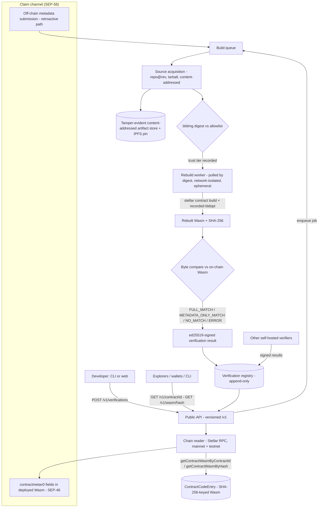

# Soroscan Verify — Contract Source Verification Service

**Grant proposal in response to the SDF RFP "Contract Source Verification Service" (Q2 2026)**

- **Applicant:** Bleu (bleu.studio)
- **Repository:** `scf-contract-source-verification` (Apache-2.0, public)
- **Working MVP:** chain reader, verify-by-contract-ID CLI, pinned Docker build toolchain, live testnet fixture with a deterministic on-chain hash match
- **Date:** June 2026

---

## 1. Summary & current state

Soroban contracts are deployed as opaque Wasm blobs. The ledger stores uploaded
bytecode in a `ContractCodeEntry` keyed by the SHA-256 of the executable, and a
deployed instance references that code by hash. Source verification therefore
reduces to a single falsifiable question: *can a candidate source tree be
rebuilt into a Wasm whose SHA-256 equals the hash the ledger reports for this
contract?* This proposal describes a hosted, free, public verification service
that answers that question at ecosystem scale: it consumes the SEP-58 metadata
vocabulary (`bldimg`, `bldopt`, `source_repo`, `source_rev`, `tarball_url`,
`tarball_sha256`), rebuilds source inside SDF-allowlisted trusted build images,
byte-compares the result against deployed Wasm, and serves signed verification
results to explorers, wallets, and the Stellar CLI through a stable, versioned
API — so the ecosystem gets one shared result layer instead of every consumer
re-running rebuilds or trusting a single hardcoded verifier.

We are not proposing to start from zero. The public MVP repository already
proves the core verification primitive end to end:

- **A deterministic rebuild matches the chain.** A sample Soroban contract
  (`contracts/hello-soroban`, soroban-sdk 25.3.1, target `wasm32v1-none`) is
  deployed on testnet as contract
  `CDVSGPL3HFBGJ6ZEYQUAVE3OH3XE2ZE5ZT2GWPA3LKOYVD4UBPQJ2VHB`. Rebuilding its
  source with the pinned toolchain (`stellar contract build --locked`, rustc
  1.91.1, stellar-cli 26.1.0) produces a 1,060-byte Wasm whose SHA-256 —
  `6fe7bd58e5a33dc27daefc74acfae6eb70f101fdbde860475cf18fde87288e4b` — equals
  (a) the hash the CLI prints at upload, (b) the hash the ledger stores in the
  `ContractCodeEntry` (confirmed via `stellar contract fetch`), and (c) the
  hash our chain reader computes from the Wasm it pulls over RPC. Two clean
  rebuilds on the same toolchain produce the identical hash: determinism is
  demonstrated, not assumed.
- **A chain reader over Stellar RPC.** `reader/src/chain-reader.ts` fetches
  on-chain Wasm and computes its SHA-256 by contract ID
  (`getContractWasmByContractId`) or directly by Wasm hash
  (`getContractWasmByHash`) using `@stellar/stellar-sdk`'s `rpc.Server` — the
  by-hash path matters because one verified hash covers every contract
  instance that references it.
- **A verify-by-ID CLI with a graded verdict model.** `soroscan-verify verify
  --id <C...> --wasm <rebuilt.wasm>` compares the rebuilt artifact against the
  chain and returns one of four verdicts: `FULL_MATCH` (byte-identical),
  `METADATA_ONLY_MATCH` (differs only in the SEP-46 `contractmetav0` custom
  section — detected structurally by parsing the Wasm section table and
  re-comparing with that section stripped), `NO_MATCH`, or `ERROR`. The CLI
  exits 0 only on `FULL_MATCH`, making it scriptable in CI.
- **A pinned, network-isolated build environment.** `docker/Dockerfile` pins
  rustc/cargo, the stellar-cli version, and the `wasm32v1-none` target, and the
  rebuild runs with `--network=none` — compile-time network isolation is
  already demonstrated, not planned. `docker/toolchain-manifest.json` records
  the resolved toolchain so a third party can re-derive the same hash from the
  same image.

The grant funds the path from this proven primitive to the service the RFP
asks for: a multi-verifier result layer with signed verdicts, all three SEP-58
source modes, an SDF-anchored image allowlist with explicit trust tiers, a
free public query API, retroactive verification for already-deployed
contracts, explorer and wallet integrations, a third-party security audit
through the SDF audit bank, and a production operations posture.

## 2. Architecture & SEP-58 alignment

SEP-58 ("Contract Build Reproducibility for Verification", draft by Leigh
McCulloch) defines a storage-independent vocabulary that lets anyone re-run a
contract's build and compare the output to the deployed bytes. The service is
architected as a direct consumer of that vocabulary: every field in SEP-58
drives a specific, auditable pipeline step, and nothing in the pipeline
depends on metadata outside the SEP. Canonically the fields live in the Wasm's
`contractmetav0` custom section (per SEP-46); the service also accepts the
same fields through off-chain submission for contracts deployed before the
tooling existed (§7).

| SEP-58 field | Semantics (per the SEP) | Pipeline step it drives |
|---|---|---|
| `bldimg` | Fully-qualified container image, **pinned by digest** | Image resolution: the digest is checked against the allowlist (§4), assigned a trust tier, pulled by digest — never by tag — and used as the rebuild environment. Tag-only references are rejected at intake. |
| `bldopt` | One shell-style flag per entry, passed verbatim as a single argument | Build invocation: each recorded flag is appended, verbatim and in order, to the `stellar contract build` command inside the container. No flag interpolation or shell evaluation occurs on the host. |
| `source_repo` | HTTPS URL of the source repository | Source acquisition, mode 1: clone the repository (no system-git dependency in the worker). |
| `source_rev` | Full 40-character commit SHA-1 | Source acquisition, mode 1: check out exactly this commit; branch or tag names are not accepted as substitutes. |
| `tarball_url` | URL where the source tarball can be downloaded | Source acquisition, mode 2: download the tarball over HTTPS or IPFS (§3). |
| `tarball_sha256` | SHA-256 of the tarball bytes | Integrity gate and content address: the downloaded bytes are hashed and must equal this value before extraction (mode 2); alone, it is the lookup key for content-addressed private source (mode 3). |

The end-to-end flow:



Every box above the registry already has a working ancestor in the MVP repo:
the chain reader, the comparison and verdict logic, and the pinned
network-isolated rebuild container are running code; the queue, registry,
signing layer, and public API are the grant-funded build-out. The service
operates against **both mainnet and testnet** from launch — the MVP's network
resolver is testnet-only by deliberate guard, and lifting that guard plus
mainnet RPC configuration is part of milestone M2 (§11).

A deliberate architectural property: verification is keyed by **Wasm hash**,
not contract ID. The contract-ID endpoint resolves the instance's current code
reference and joins it to verifications of that hash, so one successful
verification covers every instance sharing the bytecode, and contract upgrades
(re-pointing to a new hash) naturally surface as "this instance's current code
is unverified" rather than stale green badges.

## 3. Source modes

The service supports all three SEP-58 source modes as first-class citizens —
none is an afterthought, because each serves a real publishing posture in the
ecosystem.

**Mode 1 — public repository (`source_repo` + `source_rev`).** The worker
clones the repository and checks out the exact recorded commit. Because a git
commit SHA-1 is not a content commitment over the *built tree* with the
strength we want for long-term records, the worker then produces a canonical
source tarball of the checked-out tree and records its SHA-256 — so every
verification, regardless of mode, ends up anchored to a content-addressed
source artifact. If the repository later disappears or rewrites history, the
verification record still points at an artifact we (and IPFS) hold.

**Mode 2 — hosted tarball (`tarball_url` + `tarball_sha256`).** The service
downloads the tarball and verifies its SHA-256 against the recorded value
before extraction; a mismatch is a hard failure recorded as `ERROR` with a
machine-readable cause, never a silent fallback. **IPFS is a first-tier
retrieval channel alongside HTTPS**: `tarball_url` may be an `ipfs://` URI (or
a gateway URL), and for HTTPS-hosted tarballs the service pins a copy to IPFS
after integrity-checking it, then records the CID in the verification result.
This gives every verified contract a retrieval path that does not depend on
the original host staying alive.

**Mode 3 — content-addressed private source (`tarball_sha256` alone).** This
mode exists for teams whose source is not public but who still want
independent verification — typically auditor-mediated: the team provides the
tarball directly to one or more verifiers (or to an auditor operating a
verifier instance), each of which checks the hash, rebuilds, and publishes a
signed verdict *without republishing the source*. The public record then says:
"source with digest X, rebuilt in image Y, produces the deployed bytes —
attested by verifiers A and B." Consumers learn exactly as much as the
publisher chose to reveal, and the content address means any future disclosure
of the tarball is mechanically checkable against the original claim. The
multi-verifier architecture (§5) is what makes this mode meaningful: several
independent parties can corroborate a rebuild of source the public cannot see.

**Tamper-evident artifact storage.** All source artifacts — canonical tarballs
from mode 1, downloaded tarballs from mode 2, auditor-submitted tarballs from
mode 3 where the submitter permits retention — are stored content-addressed by
their SHA-256 in an append-only store, mirrored to IPFS where licensing
permits. An artifact can be added but never mutated in place; the digest in
the signed verification result is the integrity check, so tampering with
stored bytes is detectable by any reader recomputing the hash. This satisfies
the RFP's tamper-evidence requirement structurally rather than procedurally.

## 4. Trust model

A verification result is only as meaningful as the environment that produced
the rebuild. The service makes that trust explicit instead of implicit, along
two axes: *which build image was used* and *what kind of evidence backs the
verdict*.

### Image trust tiers and the allowlist

Every verification records the `bldimg` digest it ran and the **trust tier**
of that digest at evaluation time:

- **`sdf-trusted`** — the digest appears on the SDF-published allowlist. The
  default allowlist is the set of digests SDF publishes for
  `stellar/stellar-cli` images from the `stellar-cli-docker` repository, which
  is explicitly "compatible as a SEP-58 image for reproducible Stellar
  contract builds" and whose own documentation mandates pinning "to a per-arch
  single-architecture digest (`@sha256:…`) — it is the only stable reference."
  The service will consume SDF's allowlist endpoint directly once it is
  available, so allowlist updates require no service release; until then the
  allowlist is a signed, versioned configuration file seeded from the
  published `stellar-cli-docker` digests.
- **`publicly-auditable`** — a third-party image admitted through a documented
  governance process: the image's Dockerfile and build context must be public;
  the image must itself be reproducibly buildable from that context; the
  digest must be published by the maintainer; and admission requires a public
  review window (proposed as a PR against the allowlist repository, open for
  comment, with the rationale recorded). This tier exists so the ecosystem is
  not bottlenecked on SDF publishing an image for every toolchain combination,
  without diluting what `sdf-trusted` means.
- **`arbitrary`** — any other digest-pinned image. The service still performs
  the rebuild (the result is real evidence — the bytes matched or they
  didn't), but the tier tells consumers the environment itself is unvetted.
- **`unknown`** — the recorded digest can no longer be resolved or its
  provenance can no longer be established.

**Allowlist eviction downgrades; it never deletes.** If a digest is removed
from the allowlist (for example, a vulnerability is found in an image), past
verifications that used it are *not* erased — erasing them would destroy the
historical record and break every consumer that cached a result. Instead, the
trust tier recorded on those verifications is downgraded, the tier-change
event is appended to the verification's history with a timestamp and reason,
and API responses immediately reflect the new tier. Consumers that filter on
`sdf-trusted` see the downgrade at once; consumers that want the full history
can read it. Trust signals age; evidence does not.

### SEP-55 and SEP-58: two answers to two different questions

The service treats SEP-55 attestations and SEP-58 rebuild verification as
**complementary, distinct trust levels — neither subsumes the other**, and the
API exposes them as separate fields rather than collapsing them into one
badge. SEP-58's own text says it is "complementary to SEP-55, which uses
signed CI attestations instead of independent rebuild… The two address the
same trust question with different trade-offs," and we adopt exactly that
framing:

- **SEP-55** ("Contract Build Verification") answers: *did a trusted CI
  pipeline build this Wasm from this repository?* The evidence is a GitHub
  artifact attestation signed via GitHub's OIDC infrastructure — provenance
  from a named builder, available the moment the build runs, with no rebuild
  cost.
- **SEP-58 rebuild verification** answers: *does this source, built in this
  environment, produce exactly these bytes?* The evidence is an independent
  re-execution by a party with no stake in the original build.

A contract can — and ideally does — carry both: CI provenance for freshness
and a named builder, independent rebuilds for source↔binary correspondence
that doesn't depend on any single CI provider. Every API response carries
`sep55_attestation` as its own field (present/absent plus attestation
details when present), alongside the rebuild verdict, so explorers can render
both signals and consumers can apply their own policy about which they
require. During the grant we will detect and surface existing SEP-55
attestations for every contract we index, so the service strengthens the
SEP-55 ecosystem rather than competing with it.

## 5. Multi-verifier architecture & decentralization

The RFP is explicit that the ecosystem needs a shared result layer with no
single hardcoded verifier, and the architecture delivers that as a structural
property rather than a promise:

**Every verifier instance is self-hostable.** The verifier is our open-source
codebase (Apache-2.0); anyone — an explorer, an auditor, a foundation, a
skeptical developer — can run one from the public repository and Docker
images. There is no closed component, no privileged build, and no
functionality reserved for our deployment.

**Every verifier holds an ed25519 identity key and signs each result.** A
verification result is the canonical encoding of: the on-chain Wasm SHA-256,
the source artifact digest (the content address from §3), the verdict, the
`bldimg` image digest, and the timestamp — signed with the instance's ed25519
key. Signatures make results portable: a result fetched from our API, relayed
through an explorer's cache, or mirrored by a third party carries its own
proof of which verifier produced it and that it was not altered in transit.

**The public API serves results from all known verifiers.** Self-hosted
instances can register their public key and result endpoint
(`GET /v1/verifiers` lists them; registration is open and permissionless,
subject only to anti-abuse rate limits), and the aggregation layer ingests and
serves their signed results next to our own. A query for a contract returns
*the set of per-verifier results*, not a single merged opinion.

**Consumers configure a trusted-verifier set.** An explorer might trust SDF's
instance and ours; a wallet might require two independent `FULL_MATCH`
results; an auditor might trust only their own instance. The client SDK ships
with this policy surface built in.

**Disagreement is rendered per-verifier, never averaged away.** If verifier X
reproduces the bytes and verifier Y does not, the API reports both, and the
reference UI renders exactly that:

```
[√] Verified by X        FULL_MATCH      image: sdf-trusted
[!] Mismatching verification by Y   NO_MATCH   image: sdf-trusted
```

Disagreement between verifiers using the same image digest and source artifact
is a loud, important signal — it means either non-determinism in the toolchain
or a misbehaving verifier — and hiding it behind a majority vote would discard
precisely the information that matters most.

**Our hosted deployment is the first instance, not a privileged one.** It
bootstraps the network and gives explorers something to integrate against on
day one, but nothing in the protocol distinguishes it: it signs with its key
like any other instance, appears in `GET /v1/verifiers` like any other
instance, and can be dropped from any consumer's trusted set. The
decentralization goal of the RFP is met by making the hosted service
replaceable from the start.

## 6. Public API specification

The API is free, public, unauthenticated for reads, and versioned under
`/v1`. The four core endpoints:

- **`GET /v1/contract/{id}`** — resolve a contract ID to its current Wasm
  hash and return all known verifications of that hash (plus, for upgraded
  contracts, pointers to verifications of previously-referenced hashes).
- **`GET /v1/wasm/{hash}`** — all known verifications for a Wasm hash; the
  canonical lookup, since verification is keyed by bytecode.
- **`POST /v1/verifications`** — submit a verification request: a target
  (contract ID or Wasm hash), the SEP-58 fields (read from `contractmetav0`
  when present, supplied in the request body for the retroactive path), and
  the source mode. Returns `202` with a job resource that resolves to the
  signed result.
- **`GET /v1/verifiers`** — the registry of known verifier instances: ed25519
  public key, operator metadata, endpoint, and status.

Response schema sketch for a single verification record:

```jsonc
{
  "wasm_hash": "6fe7bd58e5a33dc27daefc74acfae6eb70f101fdbde860475cf18fde87288e4b",
  "network": "testnet",
  "verdict": "FULL_MATCH",            // FULL_MATCH | METADATA_ONLY_MATCH | NO_MATCH | ERROR
  "sep58": {                           // the recorded claim, verbatim
    "bldimg": "docker.io/stellar/stellar-cli@sha256:…",
    "bldopt": ["--locked"],
    "source_repo": "https://github.com/org/contract",
    "source_rev": "0e01e07…(40 hex chars)",
    "tarball_url": null,
    "tarball_sha256": null
  },
  "source_mode": "repo",               // repo | tarball | content-addressed
  "source_artifact": {                 // what was actually rebuilt (§3)
    "sha256": "…",
    "ipfs_cid": "bafy…",               // null when retention not permitted (mode 3)
    "retained": true
  },
  "image_trust_tier": "sdf-trusted",   // sdf-trusted | publicly-auditable | arbitrary | unknown
  "image_trust_history": [             // populated on downgrade (§4)
    { "tier": "sdf-trusted", "at": "2026-07-01T12:00:00Z", "reason": "allowlisted" }
  ],
  "sep55_attestation": {               // distinct field; never merged into verdict
    "present": true,
    "builder_id": "https://github.com/org/contract/.github/workflows/release.yml@…"
  },
  "verifier": {
    "id": "soroscan-main",
    "public_key": "ed25519:…",
    "signature": "…"                   // over (wasm_hash, source_artifact.sha256, verdict, bldimg digest, timestamp)
  },
  "created_at": "2026-07-01T12:03:41Z",
  "verified_at": "2026-07-01T12:05:12Z"
}
```

**Versioning policy.** `/v1` is stable from the moment it is documented:
changes within v1 are strictly additive (new fields, new optional
parameters); anything breaking ships as `/v2` with both versions served
through a published deprecation window of at least six months. **We commit
explicitly to conforming to the forthcoming verifier-API SEP once it is
authored**: when that SEP lands, we will implement it as the next API version,
serve it alongside `/v1` during transition, contribute implementation feedback
to the SEP process from our production experience, and ship the client SDK
against the SEP-conformant surface. (The verifier-API SEP does not yet exist
as a numbered document; we treat conformance as a tracked deliverable, not a
dependency that blocks launch.)

Badge and embed endpoints for explorers (`GET /v1/badge/{contractId}.svg` and
a JSON embed payload) ride on the same data and are described in §12.

## 7. Submission flows

**CLI submission.** The natural developer flow builds on the in-progress
stellar-cli work rather than competing with it. PR
[stellar-cli#2585](https://github.com/stellar/stellar-cli/pull/2585) adds
`stellar contract build --verifiable` — a reproducible build inside a
digest-pinned container that stamps the SEP-58 fields into the Wasm — and PR
[#2586](https://github.com/stellar/stellar-cli/pull/2586) adds `stellar
contract verify`, which re-runs the recorded build locally and byte-compares.
Those commands are deliberately local and one-to-one: every verifier pays the
full rebuild cost, and no verdict persists for anyone else. **Our service is
the shared aggregation layer above that CLI capability, not a competitor to
it**: a contract built with `--verifiable` is submittable to
`POST /v1/verifications` with zero additional metadata (the service reads the
SEP-58 fields straight out of `contractmetav0`), the hosted rebuild runs in
the same digest-pinned image the CLI recorded, and the resulting signed
verdict is then queryable by every explorer and wallet — once, for everyone,
instead of once per consumer. `stellar contract verify` remains the
trust-minimized local fallback for anyone who prefers not to trust any
verifier at all, which is exactly the relationship Sourcify-style services
have with local compiler runs on other chains. **We commit to supporting
whichever CLI↔service interaction shape SDF names** — service-mediated
submission (the CLI posts to a verifier and polls) or on-chain result
discovery (the CLI reads verdicts from where the ecosystem publishes them) —
and will implement the corresponding CLI integration PRs as part of milestone
M4.

**Web submission.** A web UI covers developers not working from the CLI:
paste a contract ID, the service reads `contractmetav0`, pre-fills the SEP-58
fields, and lets the submitter confirm or supply the source mode inputs. The
same form accepts a tarball upload for modes 2 and 3.

**Retroactive verification — a stated RFP priority we treat as such.**
Contracts deployed before SEP-58 tooling existed have no embedded metadata,
and non-upgradable contracts can never add it. For these, `POST
/v1/verifications` accepts the full SEP-58 field set **in the request body as
an off-chain metadata submission**: the submitter asserts "this Wasm hash was
built from this source in this image with these options," and the service
tests the assertion by rebuilding. The verdict is exactly as strong as in the
embedded case — the rebuild either reproduces the deployed bytes or it does
not; the embedded fields were never trusted, only tested. The response
records that the claim arrived off-chain (`claim_channel:
"offchain-submission"` vs `"contractmetav0"`) so consumers can distinguish
the provenance of the *claim* while relying identically on the *evidence*.
This is how the large existing population of deployed Soroban contracts —
including every non-upgradable one — becomes verifiable without redeployment.

**Docs-to-verified in under 15 minutes.** We ship and continuously test a
quickstart walkthrough with an explicit budget: from landing on the docs to a
green `FULL_MATCH` on a testnet contract in under 15 minutes, on the path
`stellar contract build --verifiable` → deploy → submit (one CLI command or
one form) → query. The MVP repo's verification loop (build, deploy, verify
the fixture) already runs in well under that budget locally; the grant work
keeps the hosted path inside it, and the walkthrough is exercised in CI
against the live testnet deployment so regressions in the developer
experience fail a build rather than a first impression.

## 8. Security & threat model

A verification service invites adversarial input by design: its core
operation is "execute a stranger's build." The threat model and mitigations:

**Malicious build execution.** A Cargo build runs arbitrary code
(`build.rs`, proc-macros). Every rebuild therefore executes in an ephemeral
container, pulled by digest, with **no network access during compilation** —
`--network=none` is already how the MVP's Docker builds run, demonstrated in
`scripts/verify.sh`, not an aspiration. Source acquisition (clone/download)
happens in a separate stage from compilation, so the build itself can never
exfiltrate or fetch. Containers run as an unprivileged user with CPU, memory,
disk, and wall-clock limits; a build that exceeds them is killed and recorded
as `ERROR` with the resource cause.

**Secret exfiltration.** Build containers carry no secrets to steal: no
service credentials, no signing keys, no cloud metadata access (the metadata
endpoint is blocked at the network layer, which `--network=none` subsumes
during compile). The verifier's ed25519 signing key lives only in the signing
service, which consumes build *outputs* (hashes and verdicts) and never
executes submitted code.

**Cross-submission contamination.** Each job gets a fresh container and a
fresh workspace; nothing writable is shared between jobs. Dependency caches,
if used for performance, are content-addressed and mounted read-only — a
poisoned artifact cannot enter the cache because entries are keyed by the
digest of what they claim to be.

**Tarball and artifact integrity.** Downloaded tarballs are hashed and
checked against `tarball_sha256` before extraction; extraction guards against
path traversal and zip-bomb expansion (size and entry-count limits). The
artifact store is append-only and content-addressed (§3), so stored-artifact
tampering is detectable by any reader.

**Result integrity.** Every result is ed25519-signed over its canonical
encoding (§5); the registry is append-only, and trust-tier changes append
history rather than rewriting records (§4). Compromise of the API serving
layer can therefore deny service but cannot forge verdicts that verify
against the published keys.

**DoS and abuse on write endpoints.** `POST /v1/verifications` is rate-limited
per source address, deduplicated by (wasm hash, source artifact digest, image
digest) so identical re-submissions return the existing job instead of new
work, capped by global queue depth with honest `429`/queue-position
responses, and bounded per-job by the resource limits above. Read endpoints
are cacheable (results are immutable once signed) and fronted by a CDN, so
query-side load does not touch the build infrastructure at all.

**Third-party audit before production.** We will undergo a security audit
coordinated by SDF through the **audit bank** before the production/mainnet
launch, scoped to the rebuild sandbox, the signing and registry layer, and
the API; the audit report and resolved findings are a milestone deliverable
(§11), and the threat model above is maintained as a living document in the
repository for the auditors to attack.

## 9. Operations & sustainability

**Availability.** The query API targets **99%+ uptime**, achieved by
separating the read path from the build path: reads are served from a
replicated database behind stateless API instances and a CDN (signed results
are immutable, hence aggressively cacheable), so build-side incidents cannot
take down queries. The write path degrades gracefully — if workers are down,
submissions queue and report status honestly.

**Latency.** Verification of standard-size contracts **completes within 5
minutes, or the API returns an explicit queued status** — `POST
/v1/verifications` answers `202` immediately with a job resource exposing
state (`queued` → `building` → `done`), queue position, and a retry hint, so
integrators never hang on a long poll. The MVP fixture rebuilds in well under
a minute; the five-minute budget covers realistic dependency-heavy contracts,
and per-toolchain warm image pulls plus read-only dependency caches (§8) keep
the common case far below it.

**Monitoring, runbook, on-call.** The deployment ships with metrics
(API availability and latency percentiles, queue depth, build duration
percentiles, verdict-rate anomalies — a spike in `NO_MATCH` across many
contracts is an early non-determinism alarm), alerting on SLO burn, a public
status page, and an operational runbook covering the failure modes we can
enumerate (RPC outages, image-registry outages, queue backpressure, allowlist
rollback). Bleu staffs an on-call rotation for the production service through
the grant period and the post-grant tail.

**Retention and egress.** Verification records are retained indefinitely —
they are small, append-only, and their value compounds. Source artifacts are
retained for the life of the service and pinned to IPFS where licensing
permits, with the IPFS CID in the record so the ecosystem can co-pin; mode-3
artifacts are retained only with submitter consent (§3). **Egress costs for
the public API and artifact downloads are owned by Bleu** within the grant
and tail period, bounded by CDN caching and by serving large artifacts
preferentially via IPFS; the runbook documents the cost model so any future
operator inherits a known bill, not a surprise.

**Post-grant ownership and funding tail.** Bleu commits to operating the
hosted service for at least **12 months beyond the final grant milestone** at
our own cost, while working toward the service's long-term home: because the
codebase is self-hostable and results are portable signed statements, the
hosted instance is replaceable by design (§5), and we will actively support
ecosystem operators (explorers, SDF, community) standing up peer instances —
the healthiest end state is one where our instance is one of several. Ongoing
maintenance economics (toolchain image updates, SEP conformance work) are
deliberately small: the heavy costs are bounded by caching and IPFS, and we
will propose follow-on community funding only if peer adoption has not
materialized by the end of the tail.

## 10. Prior art & approach justification

We reviewed the relevant public repositories rather than reasoning from
memory; the observations below are from the projects' current public code and
documentation, and they jointly justify a *build* (with heavy pattern reuse)
rather than an *adapt* of any single codebase.

**Sourcify ([github.com/ethereum/sourcify](https://github.com/ethereum/sourcify)).**
Sourcify is the proof that an open, shared verification layer works at
ecosystem scale, and we adopt several of its patterns directly: the open-data
repository of verified contracts; the async job API (`POST
/v2/verify/{chainId}/{address}` returning a `verificationId` to poll, then
`GET /v2/contract/{chainId}/{address}` for results — the same
submit/poll/lookup shape as our §6); a monitor service that watches chains
and proactively verifies new deployments; and the graded verdict vocabulary
("exact match" vs "match", formerly full/partial). But Sourcify's matching
mechanism cannot be adapted to Soroban, because it rests on two EVM-specific
facts: solc embeds a CBOR-encoded metadata hash *inside the deployed
bytecode* that transitively commits to the source files (Sourcify's own docs:
"Change a byte in the source code → Source code hash changes → Metadata
changes → Metadata hash changes → Deployed bytecode changes"), and
compilation is a pure function of a stdJSON input plus a single versioned
compiler binary — so Sourcify never needs a pinned *environment*, just a
pinned solc. Soroban Wasm has no compiler-enforced source commitment
(SEP-46 `contractmetav0` fields are self-declared), and a cargo build's
output depends on the whole toolchain environment. Hence our approach:
environment-pinned full rebuilds in digest-addressed images, with the
`METADATA_ONLY_MATCH` verdict as the Soroban analogue of Sourcify's partial
match (the one part of the gradient that does transfer, since `contractmetav0`
is a strippable custom section — already implemented in the MVP).

**solana-verifiable-build / solana-verify
([github.com/Ellipsis-Labs/solana-verifiable-build](https://github.com/Ellipsis-Labs/solana-verifiable-build)).**
The closest architectural template, and validation that digest-pinned Docker
rebuilds are the right primitive for toolchain-sensitive targets: build
images are selected by pinned digest, installer scripts in generated
Dockerfiles are checksum-pinned, and the README is explicit that verified
builds "should not be considered a complete security solution" —
source↔binary correspondence, not code safety, which is our framing too. Its
trust split is instructive: build parameters (repo, commit, args) are
published on-chain in a PDA signed by the program's *upgrade authority* (the
claim channel), while a remote verifier — OtterSec's API at `verify.osec.io`,
reached via `solana-verify remote submit-job` — re-runs the build and
publishes the verdict explorers consume (the evidence channel), with local
`verify-from-repo` always available as the trust-nothing fallback. We keep
that claim/evidence split but improve on two known weaknesses: Stellar's
claim channel is SEP-58 metadata embedded in the Wasm itself (no separate
on-chain registry program to deploy and trust), and where Solana's ecosystem
effectively trusts a single hosted verifier, our §5 architecture makes
multiple signing verifiers and per-verifier disagreement rendering the
day-one design rather than a retrofit.

**Stellar Expert's build workflow and the SDF prototype landscape.** The RFP
context names an SDF experimental prototype; in our review we found no public
repository named `stellar-experimental/contract-verifications` (the obvious
URLs 404), and the substantive existing Soroban prior art is
**[stellar-expert/soroban-build-workflow](https://github.com/stellar-expert/soroban-build-workflow)**
(OrbitLens), the reusable GitHub Actions workflow behind stellar.expert's
contract validation and the origin of what became SEP-55. It compiles
contracts in CI, publishes releases with the Wasm and its SHA-256, and
"generates and uploads build attestations" (GitHub artifact attestations);
validation checks the attestation's `runDetails.builder.id` against the
trusted workflow path. Three observations from its README and the SEP-55
discussion ([stellar discussion
#1573](https://github.com/orgs/stellar/discussions/1573)) shaped this
proposal. First, the trust chain is contract → GitHub attestation → GitHub
Actions runner: nobody independently rebuilds, and discussion participants
noted attestations don't prevent build-time injection. Second, it is
single-surface: StellarExpert is effectively the lone consumer/validator, and
GitHub is a single point of failure (Rekor transparency logs, IPFS, and
GitLab support were raised in the discussion but not implemented). Third —
and most telling — the README itself warns that contracts must be deployed
*directly from the workflow's release artifacts* "otherwise the deployed
contract hash may not match the release artifacts due to compilation
environment variations." That is the workflow acknowledging exactly the gap a
rebuild service fills: Soroban builds are environment-sensitive, so a
verification layer must pin the environment and re-execute, not attest. None
of this makes SEP-55 inferior — it answers the provenance question cheaply
and instantly, and we surface its attestations as a first-class field (§4) —
but it is why the rebuild layer needs to exist as well.

**stellar-cli PRs [#2585](https://github.com/stellar/stellar-cli/pull/2585)
and [#2586](https://github.com/stellar/stellar-cli/pull/2586)** (both open
and unmerged at the time of writing) supply the local half of the SEP-58
story: `build --verifiable` rejects tag-only image references (digest-pinned
`--image` required), implies `--locked`, requires a clean git tree, and
stamps `bldimg`, `bldopt`, and source identification into the Wasm; `contract
verify` reads the embedded metadata, re-runs the recorded build, and
byte-compares, with a trust prompt before pulling unrecognized images and
tarball sources "never default-trusted." What the CLI pair deliberately does
not provide — persistent verdicts, a queryable registry, badges, bulk and
retroactive verification, multi-verifier aggregation — is precisely this
service (§7).

**Why build rather than adapt:** Sourcify's core is EVM-metadata-specific;
solana-verify's claim channel is a Solana program and its service half
(OtterSec's backend) is not the open-source part; the SEP-55 workflow is an
attestation producer, not a rebuild verifier. Meanwhile the genuinely
chain-specific pieces we need — RPC chain reading, `contractmetav0` parsing,
verdict logic, the pinned rebuild container — are already written and tested
in our MVP repo. We therefore build the service on our existing Soroban-native
foundation while deliberately importing the proven patterns: Sourcify's open
data and API shape, solana-verify's digest-pinned rebuild discipline and
claim/evidence split, and SEP-55 coexistence as designed by SEP-58 itself.

## 11. Milestones

Milestones are mapped directly to the RFP's deliverables list. Each milestone
has an objective completion test.

**M1 — Audit-ready service codebase.** The open-source, self-hostable
codebase (RFP deliverable 1) feature-complete for audit: multi-verifier
signing (§5), allowlist enforcement with trust tiers and downgrade semantics
(§4), all three source modes with IPFS retrieval and the tamper-evident
artifact store (§3), sandboxed rebuild workers (§8), and the written threat
model. *Done when:* a third party can clone the repo, stand up a full
verifier instance from docs alone, and verify the MVP fixture end to end;
audit scope agreed with the SDF audit bank.

**M2 — Security audit and hosted deployment.** Third-party audit through the
SDF audit bank with the report published and findings resolved (RFP
deliverable: audit report and resolved findings); the hosted service deployed
publicly against **testnet and mainnet** (RFP deliverable: public
deployment), including the mainnet chain-reader configuration and the
retroactive submission path. *Done when:* the audit report and remediations
are public, and `GET /v1/contract/{id}` answers for both networks on the
production endpoint.

**M3 — Stable public API, client SDK, and documentation.** The `/v1` API
frozen and documented with OpenAPI (RFP deliverable: stable documented API);
the client SDK/reference client published, with the explicit conformance
commitment to the forthcoming verifier-API SEP (RFP deliverable: SDK/client
conforming to the verifier-API SEP) — implemented against the SEP if it has
been authored by this milestone, otherwise against `/v1` with the SEP
migration tracked as a standing commitment (§6); the image allowlist policy
and governance process published (RFP deliverable: allowlist policy
documentation). *Done when:* an integrator can go from the docs to rendering
verification state without contacting us, and the under-15-minute walkthrough
passes in CI against the live deployment.

**M4 — Integrations.** The reference integrations of §12 shipped (badge
endpoint, explorer embed, SDK example) plus integration documentation (RFP
deliverable: integration docs) and at least one reference integration landed
with Stellar Lab or a cooperating verifier/explorer (RFP deliverable:
reference integration), alongside the CLI interaction work in whichever shape
SDF names (§7). *Done when:* a named partner surface renders our verification
results in production for testnet and mainnet contracts.

**M5 — Production handoff and sustainability.** The operational runbook
published (RFP deliverable: operational runbook); monitoring, status page,
and on-call in steady state (§9); retention/egress cost model documented; the
12-month post-grant operating tail formally begun, including the peer-operator
support program (§9). *Done when:* SDF accepts the runbook, the SLO dashboards
are public, and at least one external party has a peer verifier instance
running or in progress.

## 12. Integrations plan

The service is only useful where users already look, so reference
integrations are deliverables, not aspirations:

- **Badge endpoint** — `GET /v1/badge/{contractId}.svg`: a cacheable SVG
  rendering the verdict and image trust tier, designed for READMEs and
  explorer pages, with per-verifier variants reflecting §5's disagreement
  rendering.
- **Explorer embed snippet** — a documented JSON payload plus a small,
  dependency-free web component an explorer can drop in to render the full
  per-verifier result set (verdicts, trust tiers, SEP-55 presence, source
  links) from one API call.
- **Client SDK example** — a TypeScript client (the natural extension of the
  MVP's reader package) wrapping the four endpoints, with the trusted-verifier
  policy surface built in and a worked example that resolves a contract ID to
  a render-ready verification summary.

During the grant we will engage the partners the RFP context names —
**OrbitLens / Stellar Expert** (whose build workflow pioneered Soroban
verification UX and whose explorer is its most prominent surface), **Aha Labs
/ rgstry.xyz**, **57B**, and **Stellar Lab** (whose Contract Explorer
currently displays SEP-55 attestation state and is the natural first surface
for showing the rebuild verdict alongside it) — to land the M4 reference
integration and to make sure the embed and SDK fit how their products
actually consume data, rather than how we imagine they do. Stellar Expert
specifically is a natural early *peer verifier* candidate, not just a
consumer, given OrbitLens's role in originating SEP-55.

## 13. Compliance & openness

The service is operated as a public good, and the RFP's compliance
requirements are properties of the design rather than policies bolted on:

- **No KYC, no gated access.** Read endpoints are anonymous and free;
  submission requires no account — anti-abuse is handled by rate limits and
  resource caps (§8), not identity. Nothing about a submitter is collected
  beyond what operating the service requires (transient rate-limit state).
- **Apache-2.0, everything.** The verifier, API, workers, SDK, badge
  rendering, deployment configuration, and documentation are all in the
  public repository under Apache-2.0 — the license the MVP repo already
  carries.
- **Self-hostable by construction.** A single documented deployment brings up
  a complete verifier instance; M1's completion test is literally that a third
  party can do this from docs alone. No closed dependencies, no privileged
  signing authority, no calls home.
- **Community-operable over time.** The multi-verifier design (§5) means the
  ecosystem can outgrow us without migration: results are portable signed
  statements, peer instances are first-class from day one, and the post-grant
  plan (§9) actively works toward a steady state where the hosted instance we
  run is one among several. The healthiest possible outcome of this grant is
  an ecosystem that no longer depends on any single operator — including us.

---

## Appendix A — RFP requirements traceability

| RFP requirement | Where addressed |
|---|---|
| Accept source submissions tied to a target Wasm hash | §7 (CLI, web, retroactive); §6 `POST /v1/verifications` |
| Rebuild in SDF-allowlisted trusted image via SEP-58 `bldimg` | §2 (field mapping); §4 (allowlist, tiers) |
| SEP-58 field consumption (all six fields) | §2 field-by-field table |
| Free, public query API by contract ID or Wasm hash | §6 (`GET /v1/contract/{id}`, `GET /v1/wasm/{hash}`); §13 (no gating) |
| Shared result layer — no per-consumer rebuilds, no single hardcoded verifier | §5 (aggregation, open registration); §7 (vs CLI 1:1 model) |
| Multi-verifier architecture with per-verifier results & disagreement signals | §5 (signing, trusted sets, disagreement rendering) |
| Mainnet and testnet | §2, §11 (M2) |
| Retroactive verification for non-upgradable / pre-launch contracts | §7 (off-chain metadata submission path) |
| All three source modes + IPFS | §3 (modes 1–3; IPFS first-tier) |
| Developer submission flow aligned with stellar-cli | §7 (PRs #2585/#2586 positioning; either interaction shape) |
| Explorer-consumable metadata | §6 (schema), §12 (badge, embed, SDK) |
| SEP-55 vs SEP-58 as distinct trust levels | §4 (complementary framing, distinct API field) |
| Verifier-API SEP conformance | §6 (versioning policy), §11 (M3) |
| Tamper-evident tarball storage; isolated rebuild environment | §3 (content-addressed store); §8 (sandbox, `--network=none`) |
| Third-party security audit before production | §8, §11 (M2, audit bank) |
| Under-15-minute developer experience | §7 (walkthrough with CI-enforced budget) |
| Decentralization | §5, §13 |
| Verification within 5 minutes or queued status | §9 (latency), §6 (`202` + job resource) |
| 99%+ uptime for the query API | §9 (read/build path separation, CDN) |
| Retention and egress ownership | §9 (retention policy, Bleu-owned egress) |
| Post-grant ownership | §9 (12-month tail, peer-operator program) |
| No KYC / no gated access | §13 |
| Open-source, self-hostable | §13, §11 (M1) |
